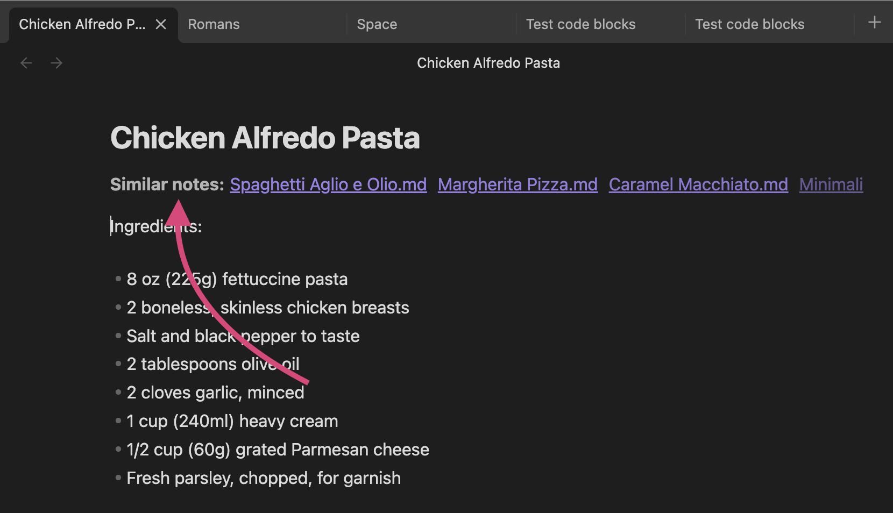
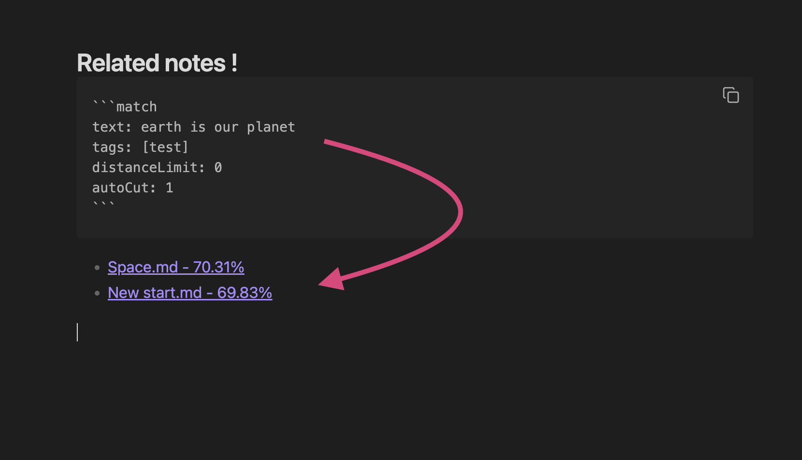
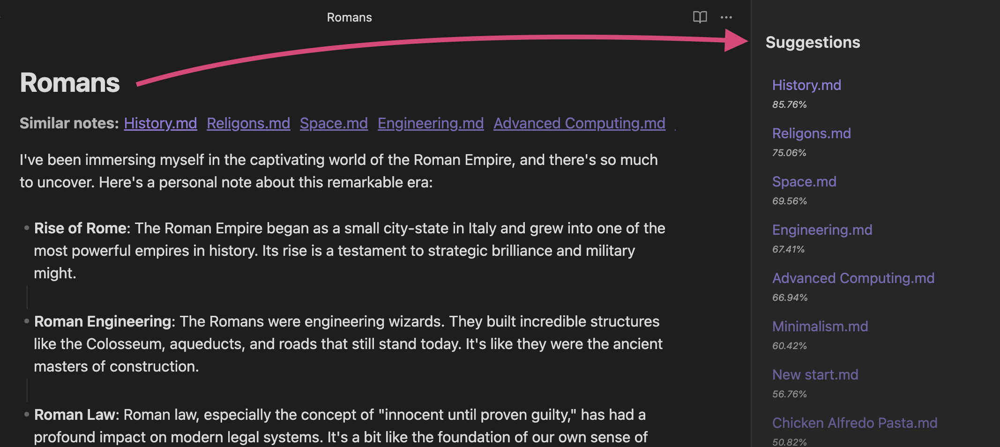
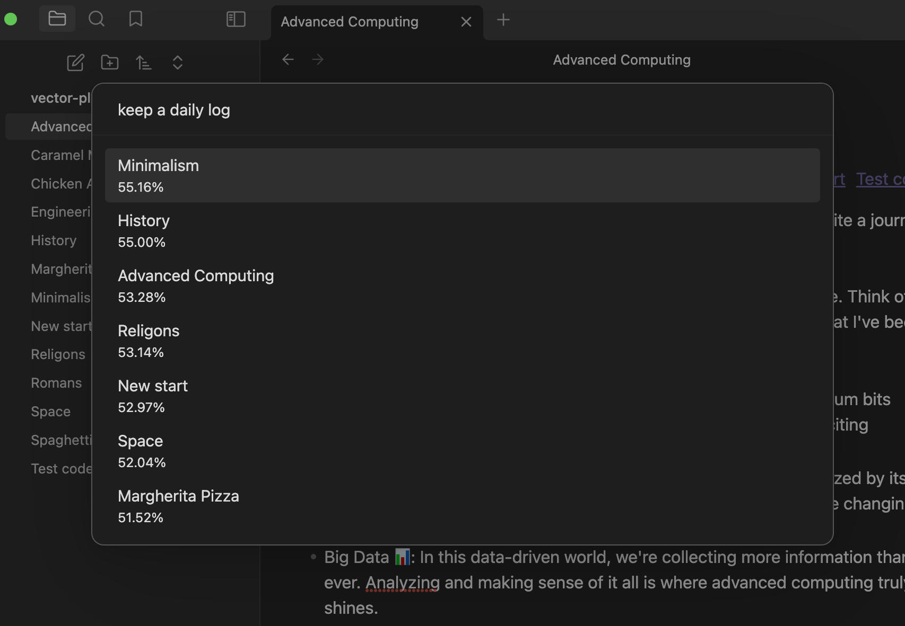

# AI Note Suggestion Plugin for Obsidian

**AI Note Suggestion** plugin for Obsidian is designed to make your note-taking experience even more seamless. It harnesses the power of AI vector search using [Weaviate](https://weaviate.io/) to suggest similar and related notes as you type, reducing your dependency on traditional tagging systems. You can also filter notes by tags, giving you the flexibility you need.

## Features:
- **AI-Powered Suggestions:** The plugin suggests similar notes based on the content you're currently typing.
- **Related Notes:** Discover related notes that you might have missed, enhancing your note-taking context.
- **Tag Filtering:** If you still prefer using tags, you can filter notes by tags as well.
- **Quick search:** Also you can quickly search anytime with command palette






## Setting Up AI Note Suggestion

To use the AI Note Suggestion plugin, you'll need to set up [Weaviate](https://weaviate.io/), an AI vector search engine. We recommend using [Docker Compose](https://docs.docker.com/compose/) for an easier setup. You can also use weaviate cloud service if you don't want to use your local machine as a server. Here are the steps to get started:

**Step 1: Install Docker**
If you don't have [Docker](https://docs.docker.com/) installed on your machine, you'll need to do so. Docker provides a platform for running [Weaviate](https://weaviate.io/) 

**Step 2: Download Weaviate Using Docker Compose**
You can check out [weaviate's install guides](https://weaviate.io/developers/weaviate/installation) for in depth information or if you are new to this follow instruction bellow,

1. Create a `docker-compose.yml` file with the following content:

```yaml
version: '3'

services:
  weaviate-obsidian:
    container_name: weaviate-obsidian
    depends_on:
      # - t2v-transformers-obsidian
      - contextionary
    command:
    - --host
    - 0.0.0.0
    - --port
    - '8080'
    - --scheme
    - http
    image: semitechnologies/weaviate
    ports:
    - 3636:8080
    volumes:
      - ./weaviate-data:/var/lib/weaviate
    restart: unless-stopped
    environment:
      QUERY_DEFAULTS_LIMIT: 25
      AUTHENTICATION_ANONYMOUS_ACCESS_ENABLED: 'true'
      PERSISTENCE_DATA_PATH: '/var/lib/weaviate'
      CLUSTER_HOSTNAME: 'node1'
      CONTEXTIONARY_URL: contextionary:9999
      ENABLE_MODULES: 'text2vec-contextionary'
      DEFAULT_VECTORIZER_MODULE: 'text2vec-contextionary'

  # for light weight model (preferable if you are using cpu)
  contextionary:
    container_name: contextionary-obsidian
    environment:
      OCCURRENCE_WEIGHT_LINEAR_FACTOR: 0.75
      EXTENSIONS_STORAGE_MODE: weaviate
      EXTENSIONS_STORAGE_ORIGIN: http://weaviate:8080
      NEIGHBOR_OCCURRENCE_IGNORE_PERCENTILE: 5
      ENABLE_COMPOUND_SPLITTING: 'false'
    image: semitechnologies/contextionary:en0.16.0-v1.2.1
    ports:
    - 9999:9999
```
here is the full compose file with other options [compose.yml](https://github.com/echo-saurav/obsidian-ai-note-suggestion/blob/main/docker/compose.yml)

2. In the directory where you saved the `docker-compose.yml` file, run the following command
```bash
docker-compose up -d
```
This command pulls the Weaviate image from Docker Hub and runs it as a container on your local machine.    

**Step 3: Configure AI Note Suggestion**

1. Once you have Weaviate up and running, go to the settings of the **AI Note Suggestion** plugin in Obsidian.
2. In the plugin settings, provide the **Weaviate Address** where your Weaviate instance is running (usually `http://localhost:3636` if you followed the default settings)


Now, you're all set to enjoy the enhanced note-taking experience provided by the AI Note Suggestion plugin!

## Code blocks for query
This is a simple code blocks for querying similar notes based on given texts

  
~~~markdown
```match
text: one
showPercentage: true
limit: 10
distanceLimit: .98
autoCut: 2
```
~~~


## Todo's
- [x] Side pane list
- [x] add yaml for code query for tags 
- [x] Code query inside files like 
- [x] remove code blocks when update files on weaviate
- [x] extract tags and update file with tags
- [x] Similar notes inside note
- [x] add autocut settings and yaml code
- [x] add distance threshold on settings and yaml code
- [x] add a search command to search by similar text
- [x] cached search result for faster query
- [ ] Split notes by regex and upload splits note in vector for long notes
- [ ] show status on every events (update,sync etc)


